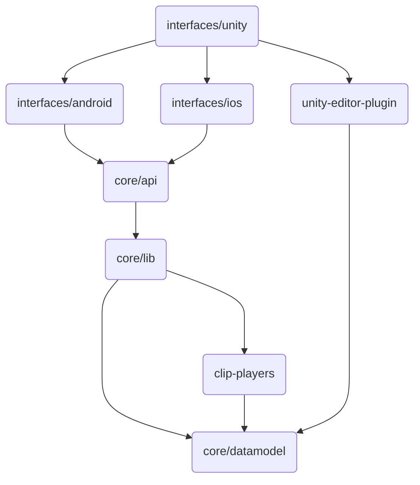

# Contents
- [Contents](#contents)
- [Contributing to Nice Vibrations](#contributing-to-nice-vibrations)
  - [Code structure](#code-structure)
    - [Overview](#overview)
    - [Where to make changes?](#where-to-make-changes)
  - [Our Development Process](#our-development-process)
  - [Pull Requests](#pull-requests)
  - [Contributor License Agreement ("CLA")](#contributor-license-agreement-cla)
  - [Issues](#issues)
  - [License](#license)
# Contributing to Nice Vibrations
We want to make contributing to this project as easy and transparent as
possible.

## Code structure 

### Overview

The Nice Vibrations Unity asset makes use of Lofelt SDK, which essentially exposes
a cross-platform library for Android and iOS.

The core library of this SDK is under `core` and is written in Rust. With the
exception of the `api` crate, this code is cross-platform. The `core/api`
exposes the core APIs in the required way each platform needs to:
- C API for iOS
- JNI API for Android

To use the core library, each platform (Android, iOS) provides their native
haptic playback methods to the core library in a form of callbacks. These native
methods are passed by through `core/api` and internally will be called by the
`clip-players` crate. 
Even though all playback functionality is accessed through `core/api`, its
implementation lives under `clip-players`.

Each platform has their own interface to call into the core library. However,
the Nice Vibrations plugin lives under `interfaces/unity`. For runtime haptic 
playback it calls into `interfaces/ios` and `interfaces/android` libraries. But
for the Unity Editor plugin, Nice Vibrations actually calls into the crate
`unity-editor-plugin`. This is why under
`interfaces/unity/NiceVibrations/Assets/NiceVibrations/Plugins` you see:
-  Android and iOS libraries, which are used for playback. They are generated by
   `interfaces/android` and `interfaces/ios`, respectively.
-  macOS and Windows libraries, which are used for the Unity Editor plugin. They
   are generated by `unity-editor-plugin` which depends `core/datamodel` and
   `core/utils`.

Below there's a diagram that tries to describe the high level structure and
dependencies of the stack:

### Where to make changes?

For instance, changes regarding the Unity Nice Vibrations asset, should be done
in `interfaces/unity`.

Changes regarding playback of a specific platform should be done in either
`interfaces/android` or `interfaces/ios`. However, if it's something related to
how Unity interacts with these platforms they probably need to be done in
`interfaces/unity` as well. Or, hypothetically, if a new Android API for haptic playback is
exposed in a new Android version, they will most likely impact `clip-players` as
well depending on the new features added, etc.

Changes to the way each platform calls into the core library or returns errors,
should be done in `core/api`. This where the core library resides.

## Our Development Process
We are expecting the community to make the necessary bug fixes and improvements
they see fit. Our team will periodically review pull requests.

## Pull Requests
We welcome your pull requests.

1. Fork the repo and create your branch from `main`.
2. If you've added code that should be tested, add tests.
3. If you've changed APIs, update the documentation.
4. Ensure all tests and GitHub Actions workflows checks pass.
5. Make sure your code lints.
6. If you haven't already, complete the Contributor License Agreement ("CLA").

## Contributor License Agreement ("CLA")
In order to accept your pull request, we need you to submit a CLA. You only need
to do this once to work on any of Meta's open source projects.

Complete your CLA here: <https://code.facebook.com/cla>

## Issues
We use GitHub issues to track public bugs. Please ensure your description is
clear and has sufficient instructions to be able to reproduce the issue.

## License
By contributing to Nice Vibrations, you agree that your contributions will be licensed
under the LICENSE file in the root directory of this source tree.