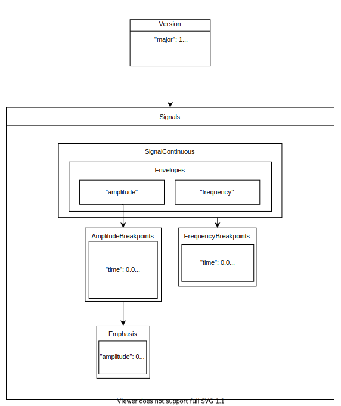

- [Haptic Data Model](#haptic-data-model)
  - [Version 1.0.0](#version-100)
    - [Content](#content)
    - [Non-haptic Data](#non-haptic-data)
    - [Haptic Data](#haptic-data)
      - [Continuous Signal structure](#continuous-signal-structure)
      - [Emphasis structure](#emphasis-structure)
    - [Validation Rules](#validation-rules)
  - [Data Model Versioning](#data-model-versioning)
- [Benchmarking](#benchmarking)
  - [Criterion](#criterion)
  - [Benchmark Data](#benchmark-data)
  - [Benches](#benches)
  - [Running Benchmarks](#running-benchmarks)
    - [Timing](#timing)
  - [Reports](#reports)

#  Haptic Data Model

The Lofelt Haptic Data Model it's a describes vibrotactile content derived from an audio signal source in a parametric way. This useful to:
- Decouple design intent and playback.
- Allow device-independent and backward compability.

This crate contains the schema of the Lofelt SDK Data model as well as related functions, conversions, and versioning.
Currently, it provides JSON serialization and deserialization of Lofelt Data, upgrade, as well as conversion to platform-specific haptic data.

## Version 1.0.0

> Older versions can be found at in the [archive](ARCHIVE.md)



An overview of the Lofelt SDK Haptic Data JSON format can be seen below.

```
{
  "version": {
    "major": int,
    "minor": int,
    "patch": int
  },
  "metadata": {
    "editor": String,
    "author": String,
    "source": String,
    "project":String,
    "tags": [
        String
    ],
    "description": String
  },
  "signals": {
    "continuous": {
      "envelopes": {
        "amplitude": [
          {
            "time": float,
            "amplitude": float
          },
          {
            "time": float,
            "amplitude": float,
            "emphasis": {
              "amplitude": float,
              "frequency": float
            }
          },
          {...}
        ],
        "frequency": [
          {
            "time": float,
            "frequency": float
          },
          {...}
        ]
      }
    }
  }
}

```

### Content

We have agreed to have the following data structure of the model.

| **Field**              | **Type**              | **Description**                                              | **Required** | **Default** |
| ---------------------- | --------------------- | ------------------------------------------------------------ | ------------ | ----------- |
| Version                | Structure of Integers | Version number represented by Major, Minor and Patch integer | ✅<br>        |             |
| Metadata               | Structure             | Contextual data for the pattern.                             | ❌<br>        | None        |
| Haptic Data: `signals` | Structure Array       | Contains haptic data.                                        | ✅<br>        |             |

### Non-haptic Data

**Version**

| **Field** | **Type** | **Description**     | **Required** | **Default** |
| --------- | -------- | ------------------- | ------------ | ----------- |
| Major     | Integer  | Major version value | ✅<br>        | 1.0.0       |
| Minor     | Integer  | Minor version value | ❌<br>        | 0           |
| Patch     | Integer  | Patch version value | ❌<br>        | 0           |

**Metadata**

| **Field**       | **Type**     | **Description**                                     | **Required** |
| --------------- | ------------ | --------------------------------------------------- | ------------ |
| Editor          | String       | Tool generating file + version:<br>cli, Lofelt Composer, Lofelt Studio, etc.         | ❌<br>        |
| Author          | String       | Name of the person (company) authoring/editing the haptic data. | ❌<br>        |
| Source          | String       | Name of the source file.                            | ❌<br>        |
| Project         | String       | Project this haptid data is used for.                       | ❌<br>        |
| Analysis Config | Structure    | Analysis parameters used, format, etc. (TBD)        | ❌<br>        |
| Tags            | String Array | Tags used for indexing in a haptic data database.           | ❌<br>        |
| Description     | String       | Description and comments on file.                   | ❌<br>        |

### Haptic Data

This model represents haptic data as signals, which contain a group of
multiple signal types.

Currently, there can only exist **one** continuous signal.\
A continuous signal must have an amplitude envelope with multiple
amplitude breakpoints and can also have a frequency envelope (comparable
to the iOS Sharpness) with multiple frequency breakpoints. In addition,
each amplitude breakpoints may have emphasis. emphasis is defined by its
amplitude and frequency values that are applied to an amplitude
breakpoint.

#### Continuous Signal structure

| **Signals** | **Signal field** | **Envelope Fields** | **Parameter Fields** | **Type**           | **Range (min, max)** | **Default** | **Description**                                              | **Required**  |
| ----------- | ---------------- | ------------------- | -------------------- | ------------------ | -------------------- | ----------- | ------------------------------------------------------------ | ------------- |
| Continuous  |                  |                     |                      |                    |                      |             | Content of a continuous haptic signal                        | ✅<br>Only one |
|             | Envelopes        |                     |                      |                    |                      |             | Parameter modulation envelopes                               | ✅             |
|             |                  | Amplitude           |                      |                    |                      |             | Defines amplitude values over time with multiple breakpoints | ✅             |
|             |                  |                     | Time                 | Float              | 0.0, ≈3.4e+38 \[s\]  | 0.0         | Time value (in seconds) of amplitude breakpoint              | ✅             |
|             |                  |                     | Amplitude            | Float              | 0.0, 1.0             | 0.0         | Amplitude value of amplitude breakpoint                      | ✅             |
|             |                  |                     | Emphasis             | Emphasis Structure |                      |             |                                                              | ❌             |
|             |                  | Frequency           |                      |                    |                      |             | Modulates frequency ratio over time multiple breakpoints     | ❌             |
|             |                  |                     | Time                 | Float              | 0.0, ≈3.4e+38 \[s\]  | 0.0         | Time value (in seconds) of frequency breakpoint              | ✅             |
|             |                  |                     | Frequency            | Float              | 0.0 - 1.0            | 0.0         | Normalised frequency value of frequency breakpoint\*         | ✅             |

> *The normalised frequency value here (ranging from 0.0 to 1.0) corresponds with the scaled output of the centroid tracker (as long as we have only one).

#### Emphasis structure

| **Emphasis field** | **Type** | **Range(min. max)** | **Description**                                                                   | **Required** |
| ------------------ | -------- | ------------------- | --------------------------------------------------------------------------------- | ------------ |
| Amplitude          | Float    | 0.0 - 1.0           | Emphasis Amplitude to be applied to the corresponding Amplitude breakpoints       | ✅            |
| Frequency          | Float    | 0.0 - 1.0           | Normalised Frequency\* value of the Emphasis applied to the Amplitude breakpoints | ✅            |

>*The normalised frequency value here (ranging from 0.0 to 1.0)
corresponds with the scaled output of the centroid tracker (as long as
we have only one).

### Validation Rules

This rules are being checked upon playback. Also, Composer should make
sure to export data that follows this rules.

 **List of Validation rules**

| Field                                              | Rule                                                                         |
| ------------------------------------------------- | ----------------------------------------------------------------------------- |
| **Continuous:** Amplitude Envelope                | Cannot be Empty                                                               |
| **Continuous**: Amplitude and Frequency Envelopes | Breakpoints need to have consecutive `time` values                            |
|                                                   | Breakpoints need to be limited to their _Range (min,max)_                     |
| **Emphasis**                                      | Needs to contain `frequency` and `amplitude` values                            |
|                                                   | Frequency and amplitude values need to be limited to their _Range (min, max)_ |


## Data Model Versioning

**Currently implemented preliminary rules**

Major version increments are non directly compatible and have to be
transformed (upgraded), minor increments and patches must be backwards
compatible within the same major version.

Changes in the the data model like deletion of fields and restructuring
of parameter groups would contribute to the **increase of major
version**. In such case a mapping of the new data model is defined in
order to ensure upgradability.

Addition of optional fields, enum types and renaming of fields(?) would
contribute to the **increase of minor version.**

# Benchmarking
## Criterion

Benchmarking is using the [Criterion crate, v0.3](https://bheisler.github.io/criterion.rs/book/) for running benches.
It is added as a "Dev Dependency" and does not get pulled into other crates.
We should probably add it separately per crate.


## Benchmark Data

Data to benchmark has been chunked into:
- 'v1' (as of 30 June 2020)
- v0

for the following lengths of audio:
- 0.5s
- 1s
- 10
- 60s
- 120s

 Samples were chopped in Ableton Live from "wildfire.mp3" then run through Studio Desktop
 with the settings:
 - normalise enabled
 - bptransients enable

NOTE: this data will need to be recreated every time our data model changes


## Benches

All benchmarks are currently sitting as one big group in ` ` ` benches/datamodel_benches` ` `

## Running Benchmarks

Currently we are benchmarking all deserialisation, validation and conversion functions for v1, v0 and ahap.
This tool can be used to look for regressions in all of these areas and further benches can be added for other core data manipulation as we go.

Run:

```` cargo bench ````

from the datamodel crate *before* making any changes to the code.
This will generate your first set of data (baseline).

Make changes you want to make, and run the command again. You should be able to see if any regressions are introduced.

### Timing
On occasion your benchmark may not run long enough. You will get a message on the console that tells you how long you should run it for.
To adjust this timing change the Duration in the benchmark.

````g.measurement_time(time::Duration::from_secs(NEWTIMEINSECONDS));````


## Reports

*Note:* you need to install gnuplot to generate reports.

````  brew install gnuplot````

Reports can be found as datamodel/target/.criterion/report/index.html
