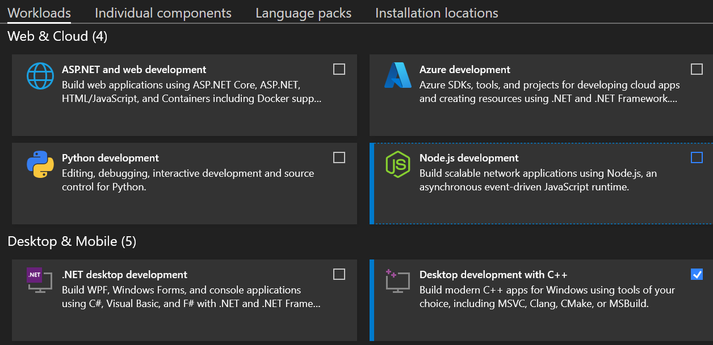

# Contents

- [Contents](#contents)
- [Background](#background)
- [Setting up the Development Environment for Mac](#setting-up-the-development-environment-for-mac)
  - [Dependencies](#dependencies)
  - [Building](#building)
- [Setting up the Development Environment for Windows](#setting-up-the-development-environment-for-windows)
  - [Dependencies](#dependencies-1)
  - [Building](#building-1)

# Background

This folder contains a plugin for the Unity editor, which is used by our Nice Vibrations
Unity plugin.

The plugin converts `.haptic` clips to a structure suitable for playback on gamepads with Unity's
Gamepad API.

This is a plugin for the Unity editor only, it is not used at runtime by the Unity engine.
The reason for that is that we can not build the plugin for all platforms supported by the
Unity engine, especially not for consoles like Playstation that require a closed SDK to be
used. We build this plugin for main platforms that the Unity editor runs on: Windows, macOS and
Linux.

The plugin is a dynamic library (.dylib on macOS, .dll on Windows, .so on Linux) that the Unity
editor loads.

The plugin is written in Rust so that it can re-use the existing Rust code like the datamodel
crate. Since Unity's C# scripting can only call C compatible API, we use extern "C" for the public
API exported by the plugin.

# Setting up the Development Environment for Mac

## Dependencies

The development environment setup is similar than to the one for iOS. Please check the [README](./../interfaces/ios/README.md) for more info.
Besides the iOS setup, it is also necessary to install the Rust target for Apple Silicon:
`rustup target add aarch64-apple-darwin`

## Building

Run `sh build-platform.sh unity-editor-plugin-host` on a terminal to build a dynamic library that Unity will load.
The dynamic library supports both Intel (x86_64) and Apple Silicon (arm64) architectures.

This script will also make sure to copy the appropriate file per platform to the respective folder in the Unity Asset plugin's folder.

You can double-check that there's a `libnice_vibrations_editor_plugin.dylib` in `interfaces/unity/NiceVibrations/Assets/NiceVibrations/Plugins/MacOS`

# Setting up the Development Environment for Windows

## Dependencies

- Install [Git for Windows](https://gitforwindows.org/). This will be needed so we can use Git Bash.
- Install Rust in Windows following this steps in [this page](https://www.rust-lang.org/tools/install).
- Since we are targeting the MSVC ABI, Rust additionally requires an installation of Visual Studio 2013 (or later).
  - Download the [Visual Studio 2019 Community version](https://visualstudio.microsoft.com/downloads/)
  - On the Visual Studio Installer, make sure to select the workload "Desktop development with C++".

  - Wait for download and installation to finish.
  - Reopen your Git Bash.
- Make sure the `x86_64-pc-windows-msvc` host is the default host when running `rustup show`.

## Building

Using Git Bash, run `sh build-platform.sh unity-editor-plugin-host` to build a dynamic library that Unity will load.
This script will also make sure to copy the appropriate file per platform to the respective folder in the Unity Asset plugin's folder.

> ⚠️ Make sure to Use Git Bash otherwise the `build-platform.sh` script won't run on Windows.

You can double-check that there's a `nice_vibrations_editor_plugin.dll` in `interfaces/unity/NiceVibrations/Assets/NiceVibrations/Plugins/Windows/x64`
